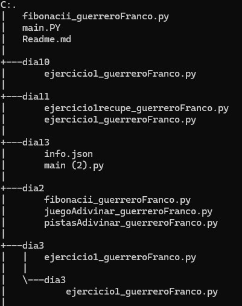
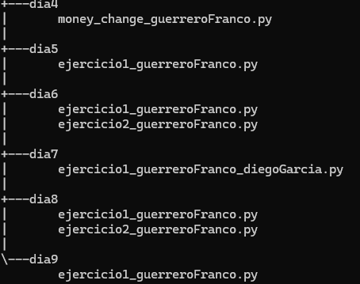

# Repositorio Python

En este repositorio se realizaron diferentes tipos de problemas de python divididos entre dias

## Descripcion 
### Dia 2 
se Realizaron 3 programas en los que se encuentra:
- fibonacci 
este programa hace una secuencia en donde se le suma los dos numeros anteriores pariendo desde el 3

- adivinar el numero 
el programa escoge un numero al azar mediante una biblioteca dandole un numero de intentos 

- adivinar el numero con pistas:
El programa escoge un numero al azar mediante una biblioteca dandole un numero de intentos, dandole pistas para que pueda encontrar el numero

### Dia 3
Se realizaron 3 programas dentro de un solo archivo utilizando funciones en donde se encuentran problemas como:
- El programa revisa si el numero es primo o no 

- Creacion de una contraseña y el programa pide que la ingrese de nuevo para ver si es la misma 

- El programa muestra mayuscula,  minuscula o numero segun lo que desee el usuario 

### Dia 4 
Se realizo un programa en donde se hace un cambio de billetes a monedas usando bucle while y for 

### Dia 5 
se realizo un programa en donde se muestar cuantas veces se puede dividir el programa 

### Dia 6 
Se realizaron dos programas donde se encuentran: 

- elimina los numeros duplicados 
- me muestra en qe posicion se encuentra el numero dentro de la lista 

### Dia 7

Se realizo un programa de un supermercado en donde permite agregar cosas al carrito de los productos que se encuentran disponibles, muestra tambien el costo que dara la cuenta y los productos que se encuentran dentro del carrito 

### Dia 8 

Se realizaron dos programas: 

- el primero es sobre una tienda de periodicos y se hacen las subscripciones calculando el tiempo y el costo que tendra 
- el segundo tendra tres secciones - una en donde se mostraran las frutas que tengan un precio mayor a 0.50 - la siguiente en donde se imprima de forma ascendente de acuerdo a la cantidad de stock que tenga la tienda 
- el tercero cambiara el nombre de las frutas a mayuscula 

### Dia 9 

Se relizo un programa de una tienda donde se muestran las cosas que guardo en el carrito y el costo que tendra lo que agrego 

### Dia 10 

Se realizo un programa en donde se muestra en que posicion estaria el numero que ingreso el usuario dentro de la lista que se le muestra 

### Dia 11

Se realizaron dos archivos:

- El primero en donde se llama un json 

- El segundo en donde se hizo un programa en donde se crean eventos o se muestra un evento en especifico que desee el usuario 

### Dia 13 

Se realizo un prpgrama de una plataforma de gestion se le pregunta al usuario en que grupo desea hacer gestion y dependiendo del grupo se le mostrara la informacion de los participantes y si va a modificar algun detalle en especifico, o si desea añadir a un nuevo estudiante 

## Lenguajes usados 

- Python 

## Estructura del repositorio 

- 
- 

## Instrucciones de uso 
- Clonar o descargar el repositorio 
- ejecutar los programas a travez de la terminal o descargando la extension code runer

## Desarrolado por

jean franco guerrero acero, estudiante de Campuslands para entrenamiento de habilidades en python.